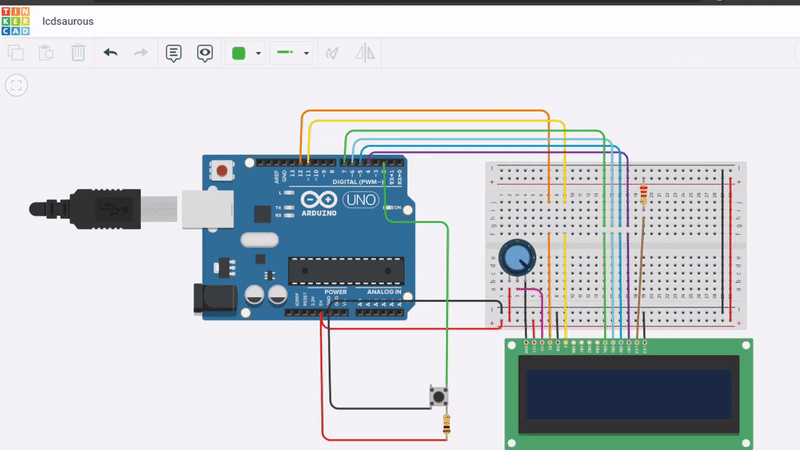
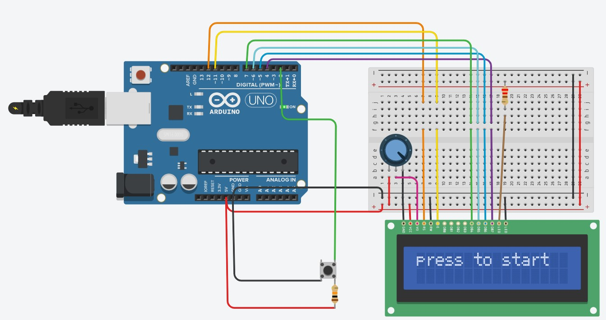
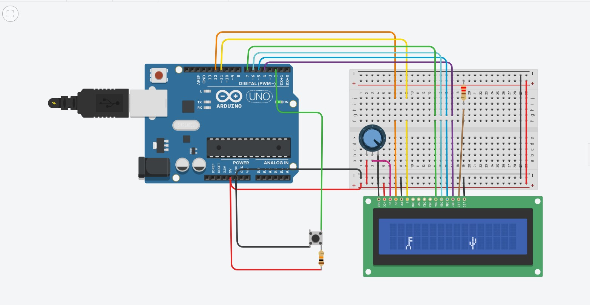
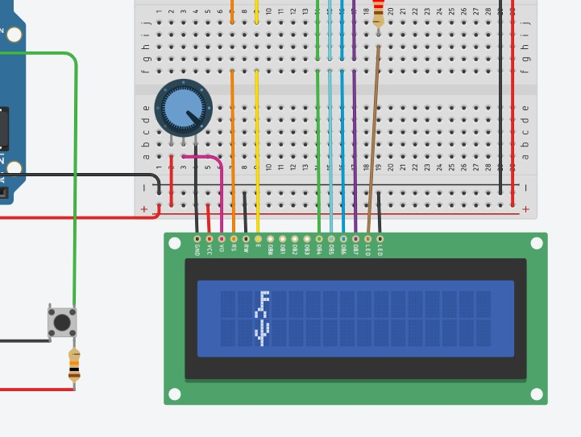
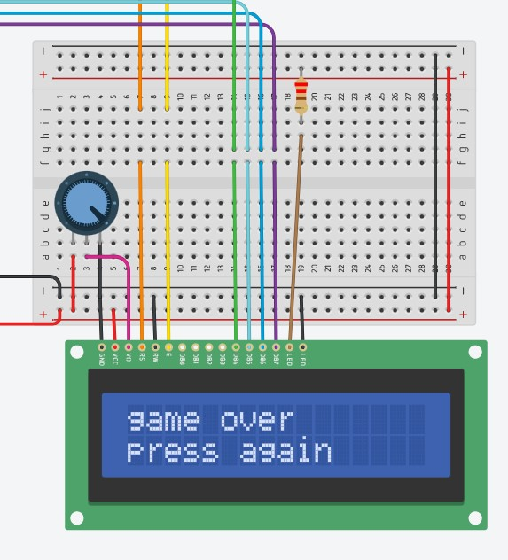

  
  
  
  
  

# Arduino lcd dinosaur chrome game

This Repository contains a simple attempt at replicating the famous dinosaur game of Chrome and running it on an arduino with an LCD and a push button.

# Sample Pictures

## DEMO 

## This is the first screen you would see when you startup the code.

## When you press the button given then the game stars running.

## When you press the button the dinosaur jumps up.

## If you don't jump in time then you crash into the tree and game over.

